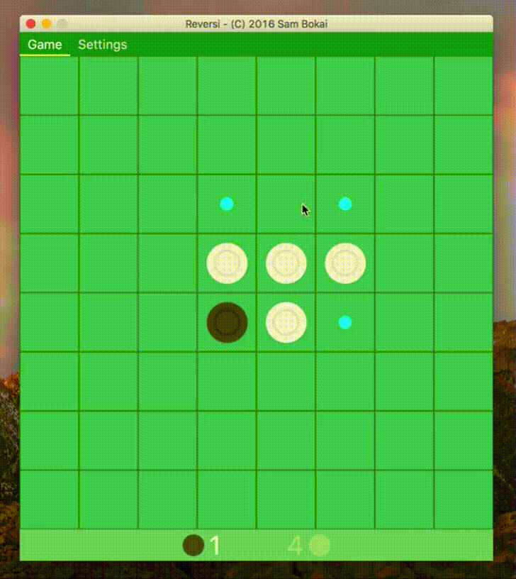

# Reversi (JavaFX)
An implementation of Reversi/Othello written in Java using the JavaFX GUI-Framework and JFoenix (JavaFX Material Design Library).

This was part of a programming class in my first semester.

### Video

### Credits
This application uses Open Source components. You can find the source code of their open source projects along with license information below. We acknowledge and are grateful to these developers for their contributions to open source.

* [JFoenix (JavaFX Material Design Library)](https://github.com/jfoenixadmin/JFoenix) Copyright (c), 2016, The JFoenix Team (Apache License, Version 2.0)
